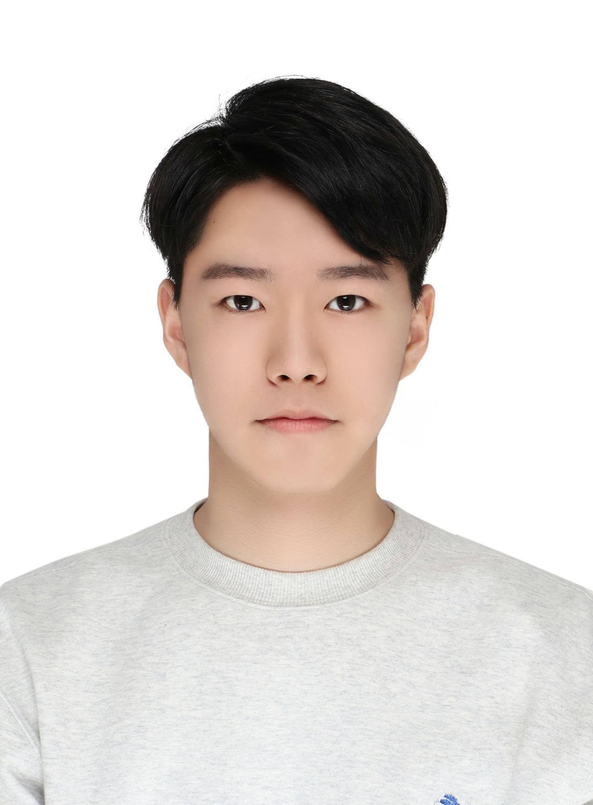
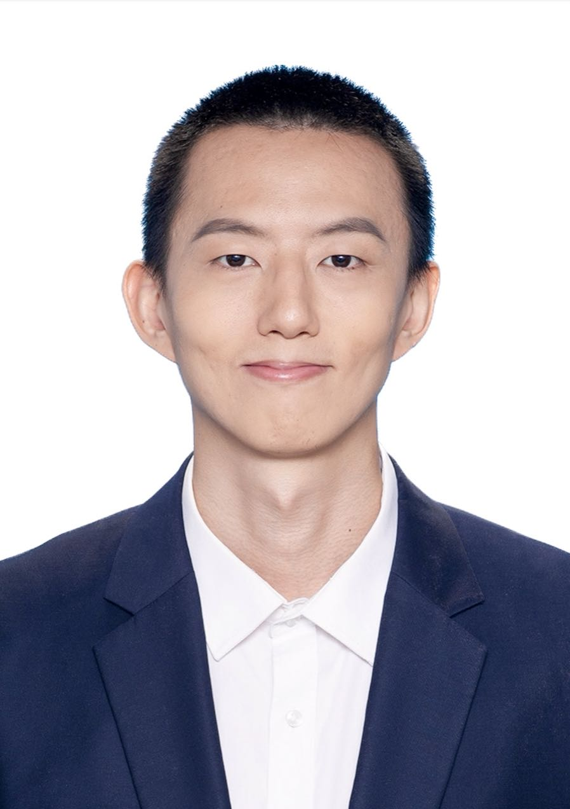

## **Summer School Overview** {#overview}

We’re excited to invite you to our Generative AI Summer School, where we’ll dive into the fascinating world of Generative AI (GenAI)—a transformative field at the forefront of artificial intelligence. GenAI leverages the power of large language models and cutting-edge technologies to generate content, solve complex problems, and drive innovation across industries.
 
This Summer School includes four seminars spread across the summer, offering a comprehensive exploration of this transformative technology. Beyond learning, this summer school is a platform for meaningful interaction. You’ll not only gain essential knowledge about the evolution, frameworks, and applications of GenAI, but you’ll also have the chance to connect with peers and exchange ideas.
 
Each seminar will cover key aspects of GenAI, taking you on a journey from its foundational development and frameworks to its practical applications and beyond. To help us plan effectively, please fill out the registration form below to indicate which seminars you plan to attend:
 
👉 [Registration](https://docs.google.com/forms/d/e/1FAIpQLSdlI10zoQHwI_eY_2odw-6rlB415Qr2OAQmTFifPSAkc1HOOA/viewform)
 
Let’s embark on this exciting journey together!

## **Schedule** {#schedule}

| Seminar 1: Development of LLM | **3 PM - 4:30 PM, December 11, 2024 (Wednesday)** |
| Seminar 2: Training and Inference of LLM | **3 PM - 4:30 PM, December 19, 2024 (Thursday)** |
| Seminar 3: Applications of LLM in Robotics | **3 PM - 4:30 PM, January 16, 2025 (Thursday)** |
| Senimar 4: Robustness of LLM | **3 PM - 4:30 PM, January 22, 2025 (Wednesday)** |

---

**Location: Room xxx, 32 Queen St, Chippendale, NSW 2008 (USYD J17 Buildling).**

---

## **Program Coordinator** {#Committee}

<figure>
    
    <b> <a href="http://changxu.xyz/">Chang Xu</a>
     The University of Sydney</b>
</figure>

---

## **Guest Lecturer** {#organizers}

<figure>
    
    <b> <a href="https://yunke-wang.github.io">Yunke Wang</a>
     The University of Sydney</b>
</figure>

<figure>
    
    <b> <a href="https://scholar.google.com/citations?user=92B4a3YAAAAJ&hl=en">Jinxu Lin</a>
     The University of Sydney</b>
</figure>

<figure>
    
    <b> <a href="https://scholar.google.com.vn/citations?user=ZJbv3YoAAAAJ&hl=en">Anh-Dung Dinh</a>
     The University of Sydney</b>
</figure>

<figure>
    
    <b> <a href="https://youzunzhi.github.io">Zunzhi You</a>
     The University of Sydney</b>
</figure>

<figure>
    
    <b> <a href="https://www.terrypei.com">Xiaohuan Pei</a>
     The University of Sydney</b>
</figure>

---
## **Contact** {#contact}

Contact the organizers at this [email](yunke.wang@sydney.edu.au).

